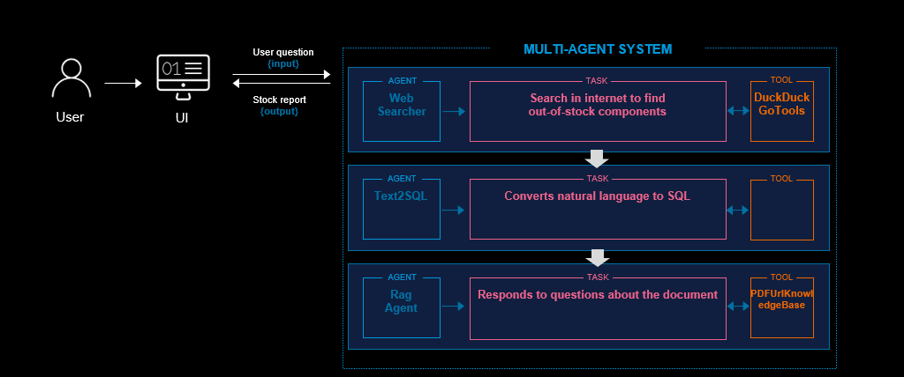

# Multiagent system 

Se  ha implementado un prototipo de sistema multiagentes con 3 agentes. 
- Un agente permite la búsqueda en internet, 
- Un agente convierte lenguaje natural a queries SQL
- Un agente responde preguntas en base un documento PDF.  

Se ha implementado el prototipo en 1día y en menos de 300 líneas de código.  
[Agno](https://github.com/agno-agi/agno) es un framework que agiliza  el prototipado de sistemas multiagentes con una curva de aprendizaje baja.



## ◻️ Demo


## ◻️ Setup 

◽  **Step 1** Install [uv](https://docs.astral.sh/uv/getting-started/installation/#standalone-installer)

◽  **Step 2**  Create a virtual environment

```bash
uv venv .venv 
```

◽  **Step 3** Install packages into the current environment.

If you have a pyproject.toml file with all the dependencies. Just run and the environment will be ready

```bash
uv pip install -e .
```

## ◻️ Usage
```bash
uv run main.py
```
Go to http://127.0.0.1:8046/